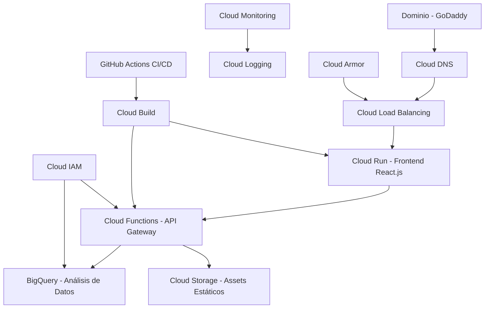
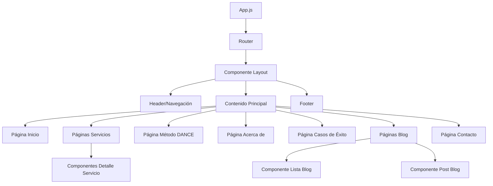

# Documento de Diseño

## Resumen

El sitio web de Kamdata será implementado como una aplicación web moderna y serverless usando React.js para el frontend y servicios de Google Cloud Platform para la infraestructura backend. La arquitectura prioriza rendimiento, escalabilidad y mantenibilidad mientras entrega una experiencia de usuario excepcional que refleja la propuesta de valor de Kamdata: "Convierte la gestión de datos en un hábito estratégico". 

El sitio web implementará la filosofía corporativa "No navegamos por ti. Te damos la brújula y te enseñamos cómo" a través de una experiencia digital que posiciona a Kamdata como habilitadores, no consultores, enfocados en mentoría y formación práctica para profesionales y líderes de PyMEs.

## Arquitectura

### Arquitectura de Alto Nivel (Basada en Arquitectura Serverless GCP)



### Stack Tecnológico

**Frontend (Cloud Run):**
- React.js 18.2.0 con componentes funcionales y hooks
- React Router DOM 6.4.0 para enrutamiento del lado del cliente
- Tailwind CSS 3.2.0 para estilos y diseño responsivo
- Framer Motion para animaciones y transiciones
- Containerización Docker para despliegue en Cloud Run

**Backend (Cloud Functions):**
- Runtime Node.js con framework Express.js
- Google Cloud Functions para endpoints de API serverless
- Triggers de Cloud Functions para procesamiento dirigido por eventos

**Datos y Almacenamiento:**
- BigQuery para datos de analytics, interacciones de usuarios, y datos estructurados
- Cloud Storage para assets estáticos, imágenes, y archivos multimedia
- Cloud Firestore para datos en tiempo real (si se necesita para características específicas)

**Infraestructura y Redes:**
- Cloud DNS para gestión de dominio
- Cloud Load Balancing para distribución de tráfico y terminación SSL
- Cloud Armor para protección DDoS y Web Application Firewall
- Cloud CDN para entrega global de contenido

**Seguridad e Identidad:**
- Cloud IAM para control de acceso y autenticación de servicios
- Cloud KMS para gestión de claves de cifrado
- Cloud Security Command Center para insights de seguridad

**Monitoreo y Operaciones:**
- Cloud Monitoring para métricas y alertas
- Cloud Logging para gestión centralizada de logs
- Cloud Trace para trazado distribuido
- Cloud Profiler para análisis de rendimiento

**Desarrollo y Despliegue:**
- GitHub Actions para pipeline CI/CD
- Cloud Build para construcción y despliegue de contenedores
- Terraform para infraestructura como código
- Cloud Source Repositories para gestión de código

## Componentes e Interfaces

### Arquitectura de Componentes Frontend



### Componentes Principales

**1. Componentes de Layout**
- `Header`: Menú de navegación con diseño responsivo
- `Footer`: Información de contacto y enlaces sociales
- `Layout`: Componente wrapper para estructura de página consistente

**2. Componentes de Página**
- `HomePage`: Sección hero con "Convierte la gestión de datos en un hábito estratégico", beneficios clave, resumen de servicios, testimonios breves, logos de aliados
- `ServicesPage`: Categorías de servicios con lema "No navegamos por ti. Te damos la brújula y te enseñamos cómo", descripciones detalladas de cada servicio
- `ServiceDetail`: Páginas individuales para Conferencias, Talleres, Mentoría Grupal, Mentoría Individual, y Nexo Estratégico con contenido específico
- `DANCEMethodPage`: Presentación interactiva de metodología con 5 pasos (Diagnostica, Alinea, Navega, Construye, Ejecuta), analogías y descarga de guía
- `AboutPage`: Información de Kamdata, misión, visión, valores K.A.M.D.A.T.A., equipo (Karla María y Armando), alianzas
- `HistoriasKamdataPage`: Casos de éxito tipo "antes y después", testimonios con rostro/nombre/profesión, videos de clientes
- `BlogResourcesPage`: Artículos sobre mentalidad digital, mini-cursos, guías descargables, videos tipo reels
- `ContactPage`: Formulario simple, WhatsApp Business, FAQ, CTAs de diagnóstico gratuito

**3. Componentes UI**
- `Button`: Botones estilizados con variantes (primario, secundario, outline)
- `Card`: Contenedores de contenido para servicios y posts de blog
- `Form`: Formulario de contacto con validación
- `Modal`: Componentes overlay para contenido adicional
- `Animation`: Componentes de animación reutilizables (brújula, puntos, rutas)

**4. Componentes de Utilidad**
- `SEOHead`: Gestión de meta tags y datos estructurados
- `LoadingSpinner`: Estados de carga
- `ErrorBoundary`: Manejo de errores y UI de fallback

### Estructura de API Backend

**Endpoints de Cloud Functions:**
- `submitContactForm`: Manejar envíos de formularios de contacto con tipos de servicio específicos y almacenar en BigQuery
- `getBlogPosts`: Recuperar contenido de blog temático (mentalidad digital, automatización, IA) desde BigQuery con caché
- `getSuccessCases`: Obtener casos de estudio tipo "antes y después" y testimonios con rostro/nombre/profesión desde BigQuery
- `getDownloadableResources`: Gestionar descargas de recursos como "Guía Rápida del Método DANCE (PDF gratuito)"
- `sendNotification`: Notificaciones por email y WhatsApp Business usando SendGrid o Cloud Functions
- `analyticsProcessor`: Procesar datos de interacción de usuarios para BigQuery con seguimiento de embudo de conversión
- `contentManager`: Gestionar actualizaciones de contenido dinámico para servicios y metodología DANCE
- `teamProfilesManager`: Gestionar perfiles del equipo (Karla María Martínez Lemus, Armando Camargo)
- `healthCheck`: Endpoint de monitoreo de salud del servicio

### Modelos de Datos

**Esquema BigQuery - Envíos de Formularios de Contacto:**
```sql
CREATE TABLE kamdata_website.contact_submissions (
  id STRING NOT NULL,
  name STRING NOT NULL,
  email STRING NOT NULL,
  message STRING NOT NULL,
  service_type STRING, -- Conferencias, Talleres, Mentoría Grupal, Mentoría Individual, Nexo Estratégico
  timestamp TIMESTAMP NOT NULL,
  status STRING NOT NULL,
  ip_address STRING,
  user_agent STRING,
  utm_source STRING,
  utm_medium STRING,
  utm_campaign STRING,
  phone STRING,
  company STRING,
  preferred_contact_method STRING -- WhatsApp, Email, Phone
);
```

**Esquema BigQuery - Posts de Blog:**
```sql
CREATE TABLE kamdata_website.blog_posts (
  id STRING NOT NULL,
  title STRING NOT NULL,
  slug STRING NOT NULL,
  excerpt STRING,
  content STRING NOT NULL,
  featured_image STRING,
  author STRING NOT NULL,
  published_at TIMESTAMP,
  created_at TIMESTAMP NOT NULL,
  updated_at TIMESTAMP NOT NULL,
  tags ARRAY<STRING>,
  status STRING NOT NULL,
  view_count INT64 DEFAULT 0,
  seo_title STRING,
  seo_description STRING,
  category STRING, -- mentalidad-digital, automatizacion, ia-aliada, etc.
  reading_time_minutes INT64,
  content_type STRING -- article, mini-course, guide, video
);
```

**Esquema BigQuery - Casos de Éxito:**
```sql
CREATE TABLE kamdata_website.success_cases (
  id STRING NOT NULL,
  client_name STRING NOT NULL,
  client_role STRING NOT NULL,
  client_company STRING,
  client_photo_url STRING,
  testimonial_text STRING NOT NULL,
  before_situation STRING,
  after_results STRING,
  service_used STRING, -- Conferencias, Talleres, Mentoría Grupal, etc.
  industry STRING,
  video_url STRING,
  case_study_url STRING,
  featured BOOLEAN DEFAULT FALSE,
  created_at TIMESTAMP NOT NULL,
  updated_at TIMESTAMP NOT NULL,
  status STRING NOT NULL -- published, draft, archived
);
```

**Esquema BigQuery - Analytics de Usuario:**
```sql
CREATE TABLE kamdata_website.user_analytics (
  session_id STRING NOT NULL,
  user_id STRING,
  timestamp TIMESTAMP NOT NULL,
  event_type STRING NOT NULL, -- page_view, cta_click, form_submit, download, etc.
  page_url STRING,
  referrer STRING,
  device_type STRING,
  browser STRING,
  country STRING,
  city STRING,
  custom_parameters JSON,
  service_interest STRING, -- which service they showed interest in
  conversion_funnel_stage STRING -- awareness, consideration, decision, action
);
```

**Esquema BigQuery - Recursos Descargables:**
```sql
CREATE TABLE kamdata_website.downloadable_resources (
  id STRING NOT NULL,
  title STRING NOT NULL,
  description STRING,
  file_url STRING NOT NULL,
  file_type STRING, -- PDF, video, audio, etc.
  category STRING, -- guia-dance, mini-curso, checklist, etc.
  download_count INT64 DEFAULT 0,
  created_at TIMESTAMP NOT NULL,
  updated_at TIMESTAMP NOT NULL,
  status STRING NOT NULL,
  requires_email BOOLEAN DEFAULT TRUE
);
```

## Estructura de Contenido Específico

### Contenido de Homepage
```javascript
const homepageContent = {
  hero: {
    headline: "Convierte la gestión de datos en un hábito estratégico",
    subtitle: "Te ayudamos a tomar decisiones con claridad y rumbo, sin complicaciones técnicas",
    visual: "Imagen o video con brújula y metáfora de 'navegar con claridad'",
    ctas: [
      "Agenda tu Diagnóstico Gratuito",
      "Descubre el Método DANCE"
    ]
  },
  beneficios: [
    "Gestión de datos como hábito",
    "Mentalidad digital práctica", 
    "Herramientas ágiles y aplicables",
    "IA co-creativa, no invasiva",
    "Acompañamiento estratégico"
  ],
  testimonios: {
    maxCount: 3,
    includeFields: ["rostro", "rol", "testimonio"]
  },
  aliados: ["ProEmpleo", "Instituto de Innovación", "DAMA México"]
};
```

### Estructura de Servicios
```javascript
const serviciosContent = {
  lema: "No navegamos por ti. Te damos la brújula y te enseñamos cómo",
  filosofia: {
    posicionamiento: "No somos consultores, somos habilitadores",
    funciones: [
      "Te damos la brújula para que tengas claridad en tu rumbo",
      "Te enseñamos a leer el terreno para que entiendas el contexto de tus datos",
      "Te guiamos para trazar rutas y llegar a tu destino con enfoque y confianza"
    ]
  },
  servicios: {
    conferencias: {
      titulo: "Despierta tu Genio Digital",
      descripcion: "Inspira, conecta, transforma",
      modalidades: ["Presencial", "Virtual"],
      target: "Ideal como punto de partida para organizaciones"
    },
    talleres: {
      titulo: "Aprende haciendo. Avanza con claridad",
      ejemplos: ["Organiza tus datos en 3 pasos", "Automatiza sin complicarte"],
      features: ["Calendario", "Solicitud personalizada"]
    },
    mentoriaGrupal: {
      titulo: "Fortalece tu mentalidad digital y aplica el Método DANCE",
      duracion: "7 semanas",
      beneficios: ["Comunidad", "Estructura", "Resultados"],
      disponibilidad: "Calendario e inscripciones abiertas"
    },
    mentoriaIndividual: {
      descripcion: "Acompañamiento 1:1 para aplicar el método a tu caso",
      caracteristicas: ["Flexible", "Confidencial", "Profundo"]
    },
    nexoEstrategico: {
      descripcion: "Servicio especializado para proyectos o líderes con visión clara",
      proceso: ["Diagnóstico", "Planeación", "Acompañamiento en Fase 0"],
      modelo: "Tarifa fija + comisión"
    }
  }
};
```

### Metodología DANCE
```javascript
const danceMethodology = {
  pasos: [
    { letra: "D", nombre: "Diagnostica", descripcion: "..." },
    { letra: "A", nombre: "Alinea", descripcion: "..." },
    { letra: "N", nombre: "Navega", descripcion: "..." },
    { letra: "C", nombre: "Construye", descripcion: "..." },
    { letra: "E", nombre: "Ejecuta", descripcion: "..." }
  ],
  analogias: ["piano", "cocina", "deporte"],
  cta: "Guía Rápida del Método DANCE (PDF gratuito)",
  aplicaciones: "Enlaces a servicios donde se aplica"
};
```

### Información Corporativa
```javascript
const corporateInfo = {
  quienesSomos: "Kamdata es una empresa de mentoría que habilita a profesionales y líderes de PyMEs para convertir sus datos en decisiones claras, sostenibles y estratégicas",
  mision: "Democratizar la gestión estratégica de datos para decisiones con propósito",
  vision: "Ser la mentora en estrategias de datos más reconocida del mundo hispano",
  valores: {
    K: "Conocimiento",
    A: "Responsabilidad", 
    M: "Mentoría",
    D: "Dinamismo",
    A2: "Acción",
    T: "Trayectoria",
    A3: "Actitud"
  },
  equipo: [
    { nombre: "Karla María Martínez Lemus", tipo: "bio con foto" },
    { nombre: "Armando Camargo", tipo: "perfil técnico" }
  ],
  alianzas: ["ProEmpleo", "Instituto de Innovación", "DAMA México", "Comunidad Kamdata"]
};
```

## Componentes e Interfaces

### Gestión de Estado Frontend

**Proveedores de Contexto:**
- `ThemeContext`: Gestionar esquema de colores y preferencias visuales
- `NavigationContext`: Manejar estado de menú móvil y rutas activas
- `FormContext`: Gestionar estados de formularios y validación

**Hooks Personalizados:**
- `useFirestore`: Obtención y caché de datos de Firestore
- `useForm`: Manejo de validación y envío de formularios
- `useAnimation`: Gestión de estado de animaciones
- `useSEO`: Actualizaciones dinámicas de meta tags

### Breakpoints de Diseño Responsivo

```css
/* Breakpoints de Tailwind CSS */
sm: 640px   /* Móvil horizontal */
md: 768px   /* Tablet */
lg: 1024px  /* Desktop */
xl: 1280px  /* Desktop grande */
2xl: 1536px /* Extra grande */
```

### Implementación del Sistema de Colores

```css
/* Propiedades Personalizadas CSS - Paleta Oficial Kamdata */
:root {
  --color-primary: #E8AC41;    /* Hunyadi Yellow - Llamados a la acción, claridad */
  --color-secondary: #FC4C4E;  /* Strawberry - Mentalidad digital, transformación */
  --color-accent: #0492C2;     /* Cerulean - Metodologías, estructura, confianza */
  --color-neutral-50: #fafafa;
  --color-neutral-900: #171717;
  
  /* Aplicación específica de colores según función */
  --color-cta: var(--color-primary);           /* Botones de acción */
  --color-transformation: var(--color-secondary); /* Elementos de cambio */
  --color-methodology: var(--color-accent);    /* Método DANCE y estructura */
}
```

### Escala Tipográfica

```css
/* Familias de fuentes según especificaciones Kamdata */
--font-heading: 'Montserrat', sans-serif;  /* Titulares */
--font-body: 'Lato', sans-serif;          /* Cuerpo de texto */

/* Escala de tipos */
--text-xs: 0.75rem;
--text-sm: 0.875rem;
--text-base: 1rem;
--text-lg: 1.125rem;
--text-xl: 1.25rem;
--text-2xl: 1.5rem;
--text-3xl: 1.875rem;
--text-4xl: 2.25rem;

/* Aplicaciones específicas */
--text-hero-headline: var(--text-4xl);     /* "Convierte la gestión de datos..." */
--text-hero-subtitle: var(--text-xl);      /* "Te ayudamos a tomar decisiones..." */
--text-service-title: var(--text-2xl);     /* Títulos de servicios */
--text-methodology-step: var(--text-lg);   /* Pasos del método DANCE */
```

## Manejo de Errores

### Manejo de Errores Frontend

**Implementación de Error Boundary:**
- Capturar errores de JavaScript en el árbol de componentes
- Mostrar UI de fallback para componentes rotos
- Registrar errores en Firebase Analytics

**Validación de Formularios:**
- Validación del lado del cliente usando React Hook Form
- Validación de campos en tiempo real con mensajes de error
- Respaldo de validación del lado del servidor en Cloud Functions

**Manejo de Errores de Red:**
- Lógica de reintento para llamadas de API fallidas
- Detección de estado offline y mensajería
- Degradación elegante para contenido faltante

### Manejo de Errores Backend

**Gestión de Errores de Cloud Functions:**
- Validación y sanitización de entrada
- Respuestas de error estructuradas con códigos de estado HTTP apropiados
- Logging de errores a Cloud Logging
- Limitación de tasa para prevenir abuso

**Manejo de Errores de Base de Datos:**
- Reglas de seguridad de Firestore para protección de datos
- Manejo de transacciones para consistencia de datos
- Procedimientos de respaldo y recuperación

## Estrategia de Testing

### Testing Frontend

**Testing Unitario:**
- Jest y React Testing Library para testing de componentes
- Cobertura de testing para todas las funciones de utilidad y hooks
- Testing de snapshots para consistencia de UI

**Testing de Integración:**
- Testing end-to-end con Cypress
- Flujos de trabajo de envío de formularios
- Tests de navegación y enrutamiento

**Testing de Rendimiento:**
- Lighthouse CI para métricas de rendimiento
- Monitoreo de tamaño de bundle
- Seguimiento de Core Web Vitals

### Testing Backend

**Testing de Cloud Functions:**
- Firebase Emulator Suite para testing local
- Unit tests para lógica de negocio
- Integration tests con Firestore

**Testing de Seguridad:**
- Testing de reglas de seguridad de Firestore
- Testing de validación de entrada
- Testing de flujo de autenticación

### Testing de Accesibilidad

**Testing Automatizado:**
- Integración axe-core para violaciones de accesibilidad
- Validación de contraste de colores
- Testing de navegación por teclado

**Testing Manual:**
- Compatibilidad con lectores de pantalla
- Verificación de gestión de foco
- Validación de atributos ARIA

## Optimización de Rendimiento

### Optimización Frontend

**Code Splitting:**
- Code splitting basado en rutas con React.lazy()
- Lazy loading a nivel de componente para componentes pesados
- Importaciones dinámicas para características no críticas

**Optimización de Assets:**
- Optimización de imágenes con formatos de próxima generación (WebP, AVIF)
- Lazy loading para imágenes y videos
- Entrega CDN para assets estáticos

**Estrategia de Caché:**
- Service Worker para funcionalidad offline
- Caché del navegador para recursos estáticos
- Persistencia offline de Firestore

### Optimización Backend

**Optimización de Cloud Functions:**
- Minimización de cold start con dimensionamiento apropiado de funciones
- Connection pooling para operaciones de base de datos
- Caché de datos accedidos frecuentemente

**Optimización de Base de Datos:**
- Estrategia de indexación de Firestore
- Optimización de consultas y paginación
- Desnormalización de datos donde sea apropiado

## Consideraciones de Seguridad

### Seguridad Frontend

**Content Security Policy:**
- Headers CSP estrictos para prevenir ataques XSS
- Definiciones de fuentes confiables para scripts y estilos
- Restricciones de scripts inline

**Validación de Datos:**
- Sanitización de entrada del lado del cliente
- Validación de formularios con manejo apropiado de errores
- Manejo seguro de contenido generado por usuarios

### Seguridad Backend

**Autenticación y Autorización:**
- Integración Firebase Authentication (si se necesita)
- Control de acceso basado en roles para funciones de admin
- Gestión y rotación de claves API

**Protección de Datos:**
- Aplicación de HTTPS en todos los endpoints
- Validación y sanitización de entrada
- Prevención de inyección SQL (inyección NoSQL para Firestore)
- Limitación de tasa y protección DDoS

### Seguridad de Infraestructura

**Reglas de Seguridad de Firebase:**
```javascript
rules_version = '2';
service cloud.firestore {
  match /databases/{database}/documents {
    // Acceso de lectura público para posts de blog
    match /blogPosts/{document} {
      allow read: if resource.data.status == 'published';
      allow write: if request.auth != null && request.auth.token.admin == true;
    }
    
    // Acceso restringido para formularios de contacto
    match /contactForms/{document} {
      allow create: if request.auth == null; // Permitir envíos anónimos
      allow read, update, delete: if request.auth != null && request.auth.token.admin == true;
    }
  }
}
```

## Estrategia de Despliegue

### Pipeline CI/CD

**Flujo de Trabajo GitHub Actions:**
1. Checkout de código e instalación de dependencias
2. Verificaciones de linting y calidad de código
3. Ejecución de unit tests e integration tests
4. Optimización de build y bundling
5. Despliegue Firebase (staging/producción)
6. Tests de verificación post-despliegue

**Gestión de Entornos:**
- Desarrollo: Emuladores locales de Firebase
- Staging: Proyecto Firebase para testing
- Producción: Proyecto Firebase de producción con dominio personalizado

### Monitoreo y Analytics

**Monitoreo de Rendimiento:**
- Firebase Performance Monitoring
- Integración Google Analytics 4
- Seguimiento de Core Web Vitals
- Seguimiento de errores con Firebase Crashlytics

**Analytics de Negocio:**
- Seguimiento de journey de usuario
- Análisis de embudo de conversión
- Tasas de envío de formularios de contacto
- Métricas de engagement de contenido

## Mantenimiento y Actualizaciones

### Gestión de Contenido

**Actualizaciones de Contenido de Blog:**
- Gestión de contenido basada en Firestore
- Interfaz de admin para creación de contenido
- Control de versiones para cambios de contenido
- Optimización SEO para contenido nuevo

### Mantenimiento Técnico

**Gestión de Dependencias:**
- Actualizaciones regulares de seguridad
- Revisiones de optimización de rendimiento
- Testing de compatibilidad de navegadores
- Auditorías de cumplimiento de accesibilidad

**Respaldo y Recuperación:**
- Respaldos automatizados de Firestore
- Procedimientos de respaldo de repositorio de código
- Planificación de recuperación ante desastres
- Políticas de retención de datos